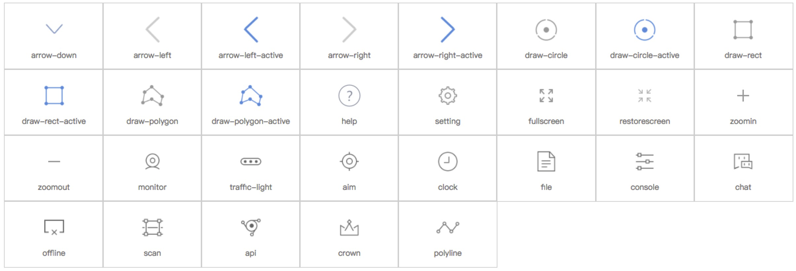
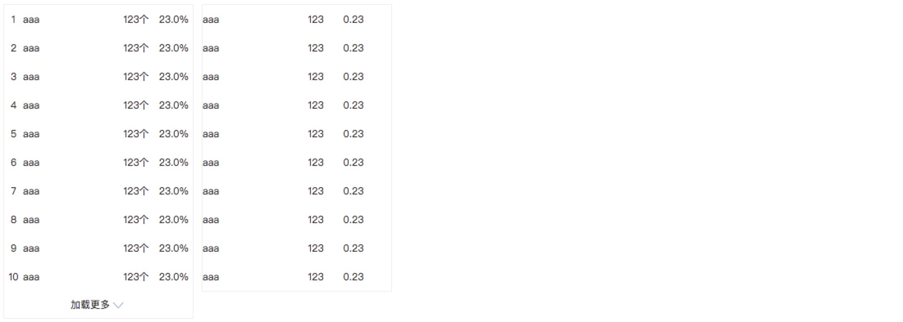
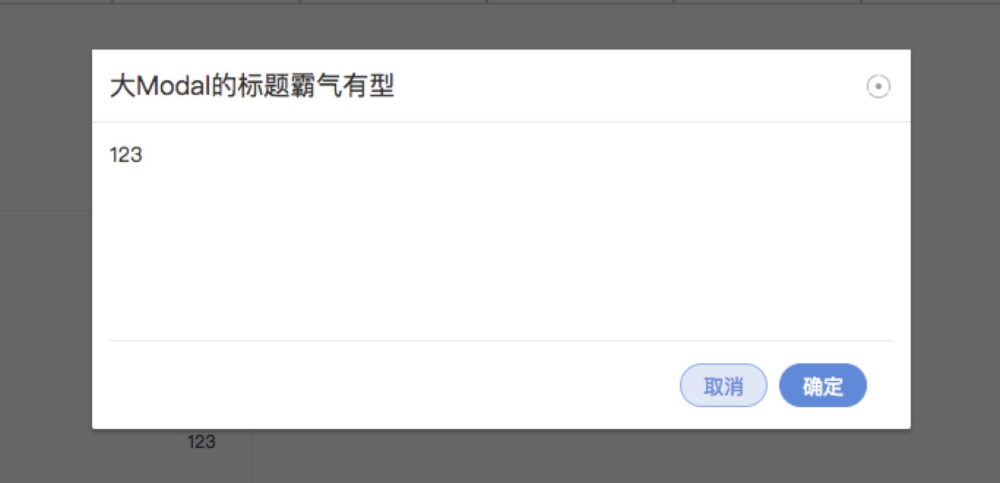

# Vis-UI 
[](https://www.npmjs.com/package/vis-ui)
[](LICENSE)
[](http://packagequality.com/#?package=vis-ui)


👍基于react的前端UI组件化通用库

vis-ui的目标：
- 一个组件库，部门之间不同项目可以通过配置自己主题的方式来复用
- 具有良好的可拓展性，对组件开发者友好，能持续沉淀UI组件
- 提供完善的文档与API接口，对用户友好，简单可依赖

如果您是vis-ui的用户，希望灵活的使用vis-ui来创建自己美丽动人的项目，下面的内容简直就是为您量身定制书写的，请仔细阅读~

如果您是vis-ui的贡献开发者，可以阅读 [vis-ui 开发者说明](https://github.com/huiyan-fe/vis-ui/blob/master/README4DEV.md)。

## 开始使用
### 安装
```
npm install vis-ui --save
```

### 使用
首先，直接引入组件
```
import {Button} from 'vis-ui';
ReactDOM.render(<Button />,mountNode);
```
然后，手动全量引入样式
```
import 'vis-ui/lib/components/index.css';
```
你就可以使用一个样式优美的按钮了！

或者你也看这里阅读[按需加载组件][1]的方式。

## 组件示例与API
官网地址：[https://huiyan-fe.github.io/vis-ui/pages/](https://huiyan-fe.github.io/vis-ui/pages/)

### Menu 导航菜单 [示例代码](./pages/examples/components/menu/index.js)  [API说明文档](./src/components/menu/docs/index.md)  
  

### Button 按钮 [示例代码](./pages/examples/components/button/index.js)  [API说明文档](./src/components/button/docs/index.md)
  

### Checkbox 多选框 [示例代码](./pages/examples/components/checkbox/index.js)  [API说明文档](./src/components/checkbox/docs/index.md)
  

### Radio 单选框 [示例代码](./pages/examples/components/radio/index.js)  [API说明文档](./src/components/radio/docs/index.md)
  

### Dropdown 下拉多选 [示例代码](./pages/examples/components/dropdown/index.js)  [API说明文档](./src/components/dropdown/docs/index.md)

### CheckboxList 多选框下拉 [示例代码](./pages/examples/components/checkbox-list/index.js)  [API说明文档](./src/components/checkbox-list/docs/index.md)
  

### Icon 图标 [示例代码](./pages/examples/components/icon/index.js)  [API说明文档](./src/components/icon/docs/index.md)
  

### Message 全局提示 [示例代码](./pages/examples/components/message/index.js)  [API说明文档](./src/components/message/docs/index.md)

### List 列表 [示例代码](./pages/examples/components/list/index.js)  [API说明文档](./src/components/list/docs/index.md)
  

### Modal 模态框 [示例代码](./pages/examples/components/modal/index.js)  [API说明文档](./src/components/modal/docs/index.md)
  

## 主题样式
### 自定义主题
如果您需要配置自己的主题文件，请参考[使用vis-ui配置自己的主题](https://github.com/huiyan-fe/vis-ui/blob/master/src/components/style/docs/index.md)。但是这要求您的项目也是用`scss`来编写样式。

### 按需加载
#### 全局加载
- 对于引入组件时，使用`import { Button } from 'vis-ui'`的写法其实是引入了`vis-ui`下的所有组件模块，可能会影响网络性能。
- 对于组件样式，如果您想使用整套的vis-ui，可以使用`import 'vis-ui/lib/index.css'`，将样式文件在根目录全部导入。
```javascript
import React from 'react';
import {render} from 'react-dom';
import 'vis-ui/lib/index.css';     // 一次性引入
import App from './index';

render( <App />, document.getElementById('wrapper'));
```

#### 按需加载
如果您想使用某个单独的vis-ui组件，单独引入组件也是一个节约资源的选择。vis-ui支持两种按需加载的方式。
##### 1. 直接从路径引入
```javascript
import Button from 'vis-ui/lib/components/button';      // 直接单独引入组件
import 'vis-ui/lib/components/button/style/index.css';     // 直接单独引入样式

```

##### 2. 通过`babel-plugin-import`插件实现按需加载
如果你使用了`babel`，那么或许这是一种更加优雅的方式，安装这个插件之后，你可以仍然这么写
```
import {Button} from 'vis-ui'
```
插件会帮你转换成`vis-ui/lib/components/xxx`的写法。另外此插件配合`style`属性可以做到模块样式的按需自动加载。我们也提供了手把手教你[配置插件的教程](https://github.com/huiyan-fe/vis-ui/blob/master/README4IMPORT.md)。


> 需要注意的是，以按需加载方式引入会同时包含一些全局样式。如果这会影响到你项目端其他样式，建议你使用上面[全局加载][2]的方式来加载样式，然后用你自己的全局样式来覆盖它。

##### 3. 最佳实践
根据个人做的项目经验来看，自认为的最佳实践还是**按需加载组件，全量引入样式**。
各位看官仅供参考，欢迎讨论~

[1]:#按需加载
[2]:#全局加载