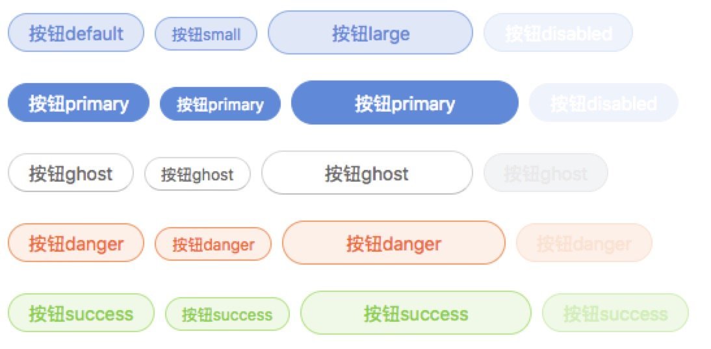
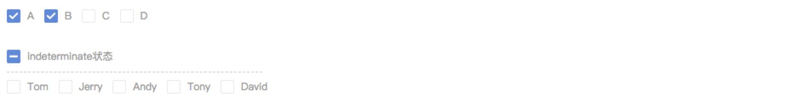
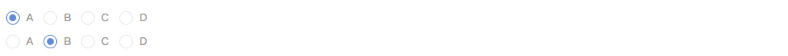
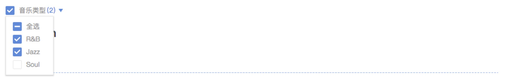

# Vis-UI [](https://www.npmjs.com/package/vis-ui)
👍基于react的前端UI组件化通用库

vis-ui的目标：
- 一个组件库，部门之间不同项目可以通过配置自己主题的方式来复用
- 具有良好的可拓展性，对组件开发者友好，能持续沉淀UI组件
- 提供完善的文档与API接口，对用户友好，简单可依赖

如果您是vis-ui的用户，希望灵活的使用vis-ui来创建自己美丽动人的项目，下面的内容简直就是为您量身定制书写的，请仔细阅读~

如果您是vis-ui的贡献开发者，可以阅读 [vis-ui 开发者说明](https://github.com/huiyan-fe/vis-ui/blob/master/README2.md)。

## 组件示例与API
演示地址：[单击此处](https://huiyan-fe.github.io/vis-ui/pages/examples/)

### Menu 导航菜单
  
[示例代码](./pages/examples/components/menu/index.js)  
[API](./src/components/menu/docs/index.md)

### Button 按钮
  
[示例代码](./pages/examples/components/button/index.js)  
[API](./src/components/button/docs/index.md)

### Checkbox 多选框
  
[示例代码](./pages/examples/components/checkbox/index.js)  
[API](./src/components/button/checkbox/index.md)

### Radio 单选框
  
[示例代码](./pages/examples/components/radio/index.js)  
[API](./src/components/radio/docs/index.md)

### Dropdown 下拉多选
[示例代码](./pages/examples/components/dropdown/index.js)  
[API](./src/components/dropdown/docs/index.md)

### CheckboxList 多选框下拉
  
[示例代码](./pages/examples/components/checkbox-list/index.js)  
[API](./src/components/checkbox-list/docs/index.md)

### Icon 图标
[示例代码](./pages/examples/components/icon/index.js)  
[API](./src/components/icon/docs/index.md)

## 样式引入
- 如果您需要配置自己的主题文件，请参考[使用vis-ui配置自己的主题](https://github.com/huiyan-fe/vis-ui/blob/master/src/components/style/docs/index.md)。但是这要求您的项目也是用`scss`来编写样式。
- 如果您想使用整套的vis-ui，可以使用`import 'vis-ui/lib/index.css'`，将样式文件在根目录全部导入
```javascript
import React from 'react';
import {render} from 'react-dom';
import 'vis-ui/lib/index.css';     // 一次性引入
import App from './index';

render( <App />, document.getElementById('wrapper'));
```
- 如果您想使用某个单独的vis-ui组件，单独引入组件独立的样式也是一个节约资源的选择。**现在版本的vis-ui单独引入的scss没有被编译成css文件，所以这要求您的项目也是使用的scss，后续会将单独引入的样式也编译成css文件，改进单独引入组件的体验**
```javascript
import React, { Component } from 'react';
import { Button } from 'vis-ui';
import 'vis-ui/lib/components/button/style/index.js';     // 单独引入

export default class App extends Component {
    render() {
        return <div>
            <Button>按钮default</Button>
        </div>;
    }
}
```
